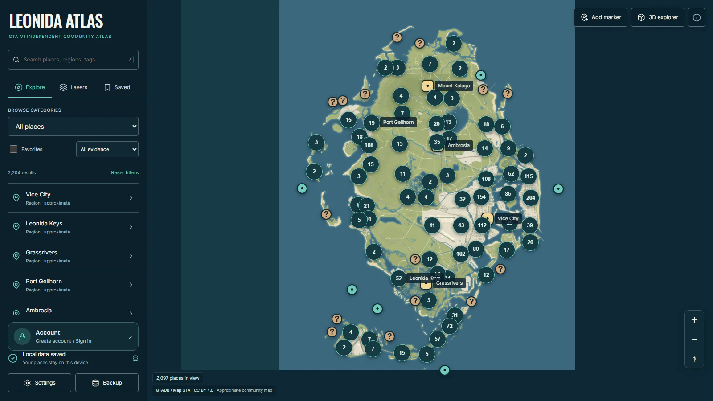
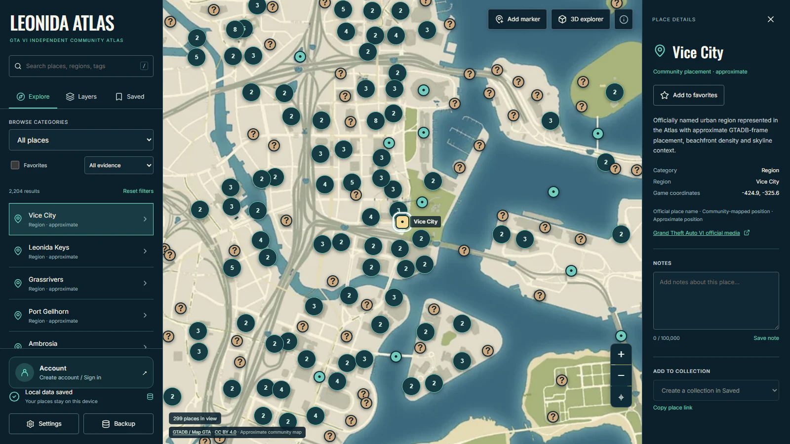

<div align="center">

<h1>LEONIDA ATLAS</h1>

<p><strong>Explore every road, landmark and rumor across GTA VI's Leonida.</strong></p>

<p>An open-source, local-first community atlas built for discovery.</p>

<p>
  <a href="https://gta6state.com/gta6-leonida-atlas/"></a>
  <a href="https://github.com/navanem/gta6-leonida-atlas/releases/latest"></a>
  <a href="https://github.com/navanem/gta6-leonida-atlas/actions/workflows/ci.yml"></a>
  <a href="LICENSE"></a>
</p>

<a href="https://gta6state.com/gta6-leonida-atlas/">
  
</a>

<p><em>2,204 searchable places. One evolving community map. Your discoveries stay yours.</em></p>

</div>

> [!IMPORTANT]
> Leonida Atlas is an independent fan project. It is not affiliated with or endorsed by Rockstar Games or Take-Two Interactive. Community positions are approximate, and unknown locations remain unknown.

## Welcome to Leonida

Leonida Atlas turns a large community reconstruction into a fast, searchable map you can actually use. Move from the state-wide view to the streets of Vice City, inspect the evidence behind a place, save your own discoveries, or step into the optional 3D explorer.

**No account is required. No map key is required. No private backend is required.** Fork it, run it locally and make it your own.

| Discover                                                        | Personalize                                              | Explore                                                                |
| --------------------------------------------------------------- | -------------------------------------------------------- | ---------------------------------------------------------------------- |
| Search 2,204 public places and six major regions.               | Save favorites, collections, notes and personal markers. | Switch from the 2D atlas to an approximate 3D reconstruction.          |
| Filter landmarks, nature, transport, businesses and evidence.   | Export and restore portable, validated backups.          | Use desktop, touch and keyboard navigation.                            |
| Keep uncertain locations visible without inventing coordinates. | Store rich personal data locally in IndexedDB.           | Reopen the installed experience offline after its first complete load. |

## Inside the atlas

### From the whole state to street-level detail

Select a region, landmark or cluster to reveal its context, source and approximate game coordinates. Add favorites, write private notes and organize places without leaving the map.

[](https://gta6state.com/gta6-leonida-atlas/?place=region%3Avice-city)

### Walk through the community reconstruction

The optional 3D explorer preserves the project's existing reconstructed world. Travel between regions, walk or run through the scene and return to the atlas at any time.

[](https://gta6state.com/gta6-leonida-atlas/?view=3d)

<div align="center">

### Ready to explore?

<a href="https://gta6state.com/gta6-leonida-atlas/"></a>

Current release: **v0.7.0** · [Release notes](RELEASES.md) · [All GitHub releases](https://github.com/navanem/gta6-leonida-atlas/releases)

</div>

## Run it locally

You need Node.js 22.12+ and pnpm 10+.

```sh
git clone https://github.com/navanem/gta6-leonida-atlas.git
cd gta6-leonida-atlas
pnpm install --frozen-lockfile
pnpm dev
```

Open `http://127.0.0.1:4330`. The public build works without environment variables, an account, a database server, a CMS or an external map provider.

### Build and verify

```sh
pnpm typecheck
pnpm lint
pnpm test:unit
pnpm build
pnpm start
pnpm test:e2e
```

`pnpm start` previews the production build on `http://127.0.0.1:4330`. Install the Playwright browsers with `pnpm exec playwright install chromium webkit` when needed.

For the complete clean-fork check, run `pnpm test:fork`. It copies the public-source allowlist to a temporary directory, excludes credentials and local environment files, installs from the frozen lockfile, runs the quality suite and exercises an isolated production preview.

## Local-first by design

- Favorites, notes, collections, personal markers and settings live in the browser's IndexedDB database.
- Writes are reported as saved only after the transaction commits.
- Backup exports are portable JSON files, capped at 10 MiB and validated before import.
- Imports merge atomically; malformed data cannot leave a partial workspace behind.
- Other tabs refresh through `BroadcastChannel`, while revision checks protect newer notes and markers from stale edits.
- The production service worker caches the app shell, public catalogue and map after the first complete online load.

Browser storage can still be cleared or evicted. Export a backup periodically and before changing hosting origin.

## Built for forks and contributions

A public fork includes the complete map, editor, local library, backup flow and optional 3D explorer. It does not need access to the official instance, its users or any private service.

Corrections, accessibility improvements, bug fixes and reviewed public data are welcome:

1. Read the [contribution guide](CONTRIBUTING.md).
2. Use the issue forms for bug reports, feature ideas or map corrections.
3. Create a focused branch and include a verifiable source for public-place changes.
4. Keep unknown positions as `position: null`; never infer game coordinates from real-world analogues.
5. Open a pull request and let the required Quality workflow run.

Suspected vulnerabilities should be reported privately through the process in [SECURITY.md](SECURITY.md).

<details>
<summary><strong>Architecture at a glance</strong></summary>

The atlas is a static **Vite + React + strict TypeScript** application. Leaflet renders the fictional coordinate system, Zustand separates domain and UI state, Dexie provides transactional IndexedDB repositories, and Three.js powers the optional 3D explorer.

```text
src/app/                      Application shell and routing
src/domain/                   Places, layers, filters and personal-data contracts
src/data/                     Validated bundled public catalogue
src/features/map/             CRS adapter, spatial index, clusters and layer rules
src/features/library/         Favorites, collections, notes, settings and backups
src/features/editor/          Personal marker creation and editing
src/features/explorer/        React adapter for the preserved 3D engine
src/features/project/         About, documentation, credits and license pages
src/features/street-leonida/  Evidence, coordinate and 3D reconstruction logic
src/stores/                   Scoped application state and serialized writes
src/db/                       IndexedDB repositories, upgrades and validation
src/plugins/                  Trusted internal module registry
src/capabilities/             Optional UI integrations and isolated workspaces
```

See the [architecture and extension guide](docs/refactor/ARCHITECTURE.md) and [decision log](docs/refactor/DECISIONS.md).

</details>

<details>
<summary><strong>Static deployment</strong></summary>

Deploy `dist/` to any static host. Build for a subdirectory with:

```sh
ATLAS_BASE_PATH=/my-atlas/ pnpm build
```

The repository also includes an independent Nginx container:

```sh
docker build -t leonida-atlas .
docker run --rm -p 8080:8080 leonida-atlas
```

Read the [production deployment guide](deploy/README.md) for hostname, path and reverse-proxy examples.

</details>

## Data, evidence and accuracy

The pinned public catalogue is derived from **GTADB / Map GTA contributors** under **CC BY 4.0**. It currently contains 2,198 GTADB records—2,091 positioned and 107 deliberately unpositioned—plus six regional entries.

Stable source IDs and evidence are preserved. Approximate placements are labeled as approximate, and missing geography stays unknown. See the [methodology](docs/METHODOLOGY.md) and [third-party notices](THIRD_PARTY_LICENSES.md).

## License

Source code is available under **AGPL-3.0-only** ([LICENSE](LICENSE)). GTADB-derived data is attributed separately under **CC BY 4.0**. Rockstar Games, Take-Two Interactive and their respective marks and media belong to their owners.

<div align="center">

**Made for explorers, mapmakers and the GTA community.**

[Explore live](https://gta6state.com/gta6-leonida-atlas/) · [Contribute](CONTRIBUTING.md) · [Report a bug](https://github.com/navanem/gta6-leonida-atlas/issues/new/choose) · [View releases](https://github.com/navanem/gta6-leonida-atlas/releases)

</div>
