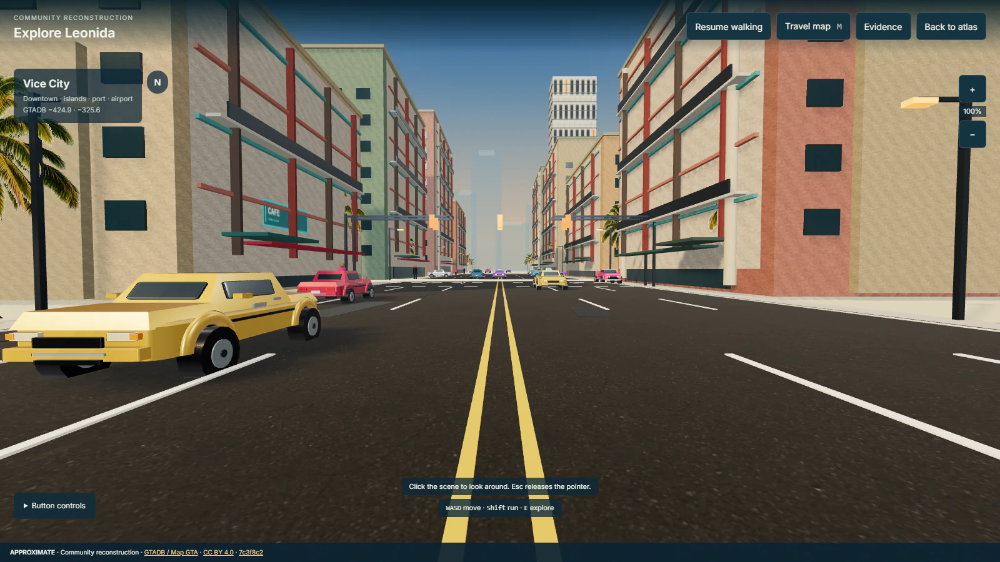
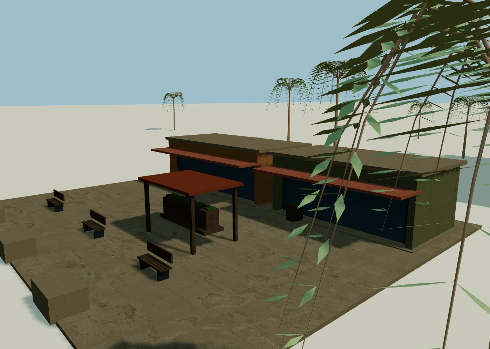
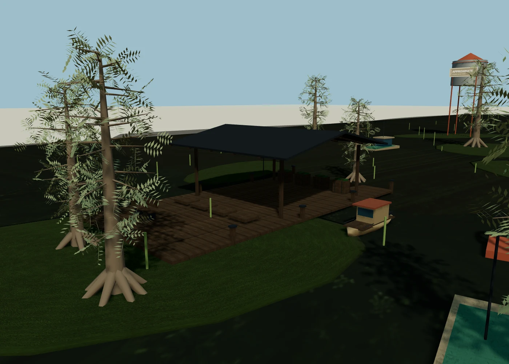

# v0.8.0 — implementation and verification

Checked on 6 September 2026. The public application and the official subdirectory container were compiled from the same rendering source. No new runtime dependency was added.

## Executed checks

- 554 unit/integration tests across 60 files, strict TypeScript, ESLint and the public production build passed.
- All 10 existing Chromium browser cases passed, including offline local data, backup validation, storage failure, cross-tab notes and selected 3D destinations. The 3D case also covers native Enter activation of Evidence, source links, travel to the Keys and renderer re-entry.
- Seven full-world views cover all six regions and the reverse Vice City direction at 1280 × 800. The final scenes use the depth-contact pipeline. No application or shader errors were reported during these captures.
- Real touch events on the official candidate at 390 × 844 moved the player and changed the view through the joystick/look pad, with the depth-contact pipeline active and no console or application errors. This is Chromium touch emulation, not a physical iPhone test.
- Independent reviews checked coordinate provenance, geometry clearance, resource ownership, async texture loading, shader state restoration and private-content boundaries. Unsupported HDR and failed effect programs are tested with injected capabilities/errors; these are not claims of coverage on every GPU driver.
- All 15 local surface assets match their recorded SHA-256 hashes and total 8,836,564 bytes. Original download hashes and CC0 provenance were also checked. Clean Asphalt uses its documented 2.1 m scale in world coordinates, including rotated/segmented roads.

The browser host uses Chromium/Linux with SwiftShader software rendering. Captures and counters establish rendering and interaction behavior, not hardware FPS or real iOS graphics performance. This pass did not run mobile WebKit.

## Visible changes and corrections

Deep facade openings, window interiors and balconies replace flat frontage strips. Nearby mapped road detail follows urban/rural context. Six regional scenery groups add shaded shops, a marina, stilt structures, weathered retail, industrial pipework and trail facilities.

Visual inspection corrected enlarged asphalt grain, excessive dry-road reflections, oversized cypress leaves, palms planted in marina water, generic trees intersecting Kalaga relief, a buried trail shelter and tyres below the Vice City road. Contact shading and sharper nearby shadows improve depth; an unavailable effect configuration retains direct rendering.

The following two captures isolate arrival geometry for inspection. They use a separate inspection camera/light setup, not the complete application's atmospheric composite.

## Source scope and remaining limits

Fifteen unpositioned regional observations cite [Rockstar's public Leonida material](https://www.rockstargames.com/VI/only-in-leonida). They are available in place details, search and Evidence. Travel uses existing reviewed regional arrivals; the observations do not create confirmed exact map coordinates. The catalogue links the [Extended Look](https://www.rockstargames.com/VI/an-extended-look) without claiming details inferred from footage that was not inspected.

Photographic surfaces come from the five [credited CC0 assets](../../THIRD_PARTY_LICENSES.md). The [manifest](../../public/assets/street-leonida/surfaces/manifest.json) records source/download URLs, licenses, dimensions and source/output checksums. No new Rockstar image or game model is redistributed.

The reconstruction remains visibly simplified, especially distant architecture, vehicles/riders and parts of the foliage. Exact game models, comprehensive surveyed terrain and reliable dimensions are absent. Decorative parcels and local relief remain APPROXIMATE. Existing GTADB coordinates and CC BY 4.0 attribution, local workspaces, deployment-only accounts/Analytics and release history from v0.5.0 are retained.
