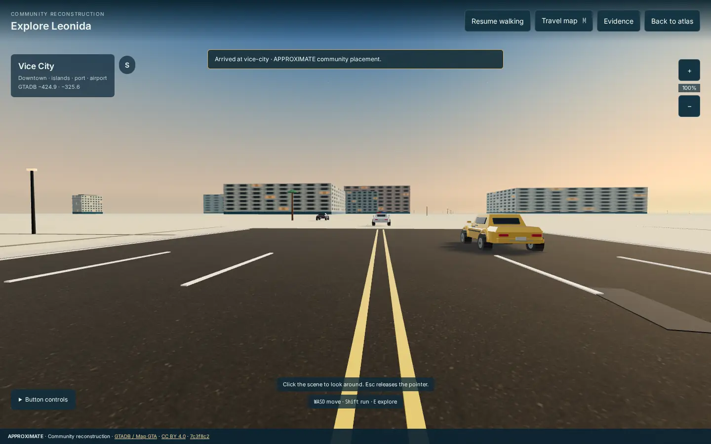
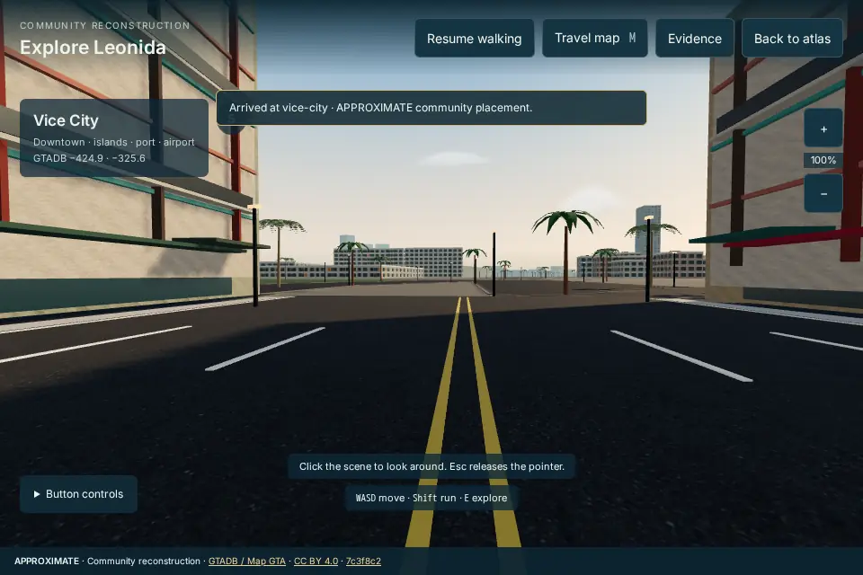
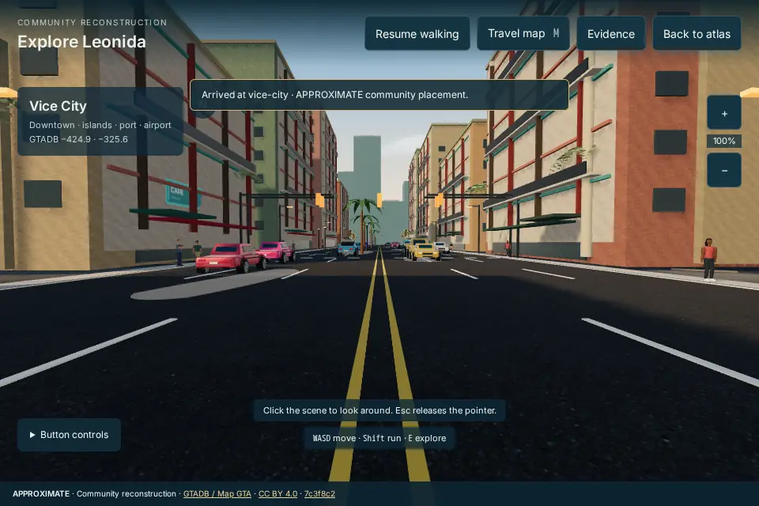
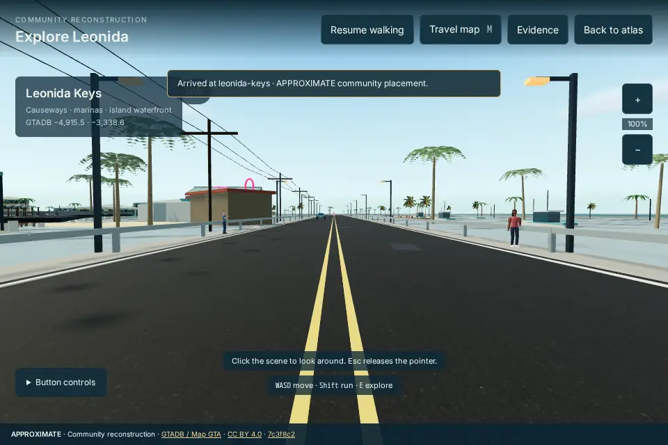
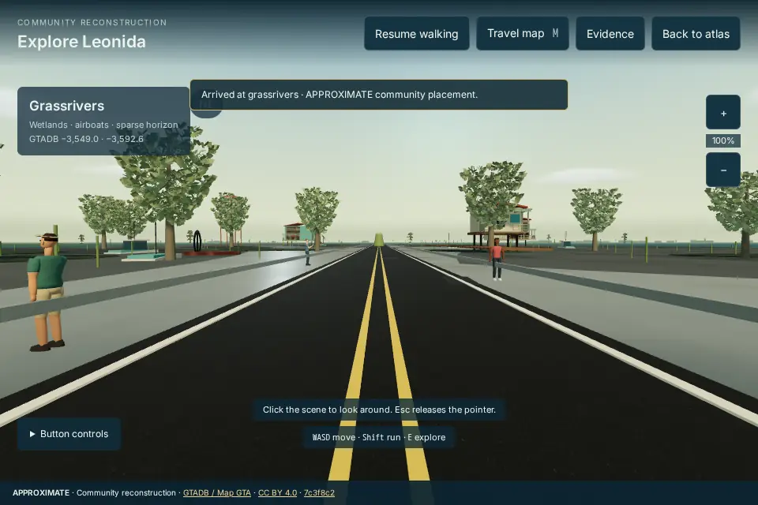
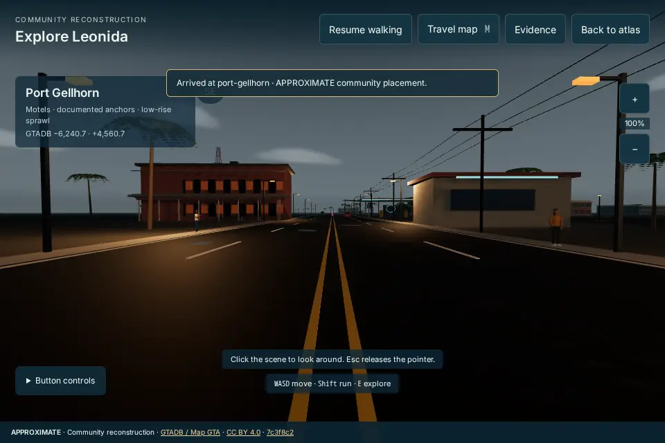
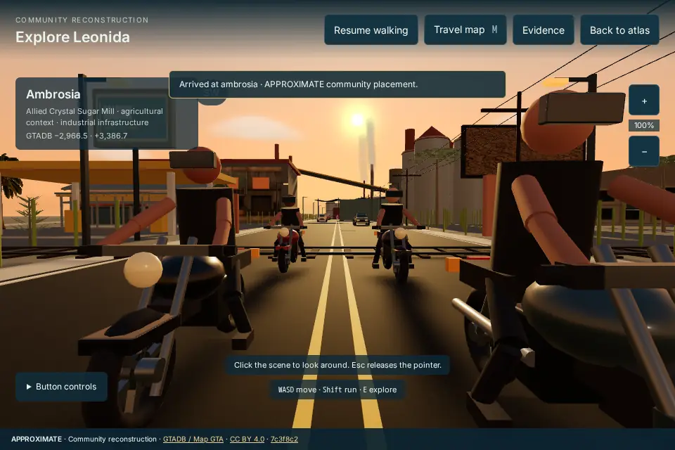
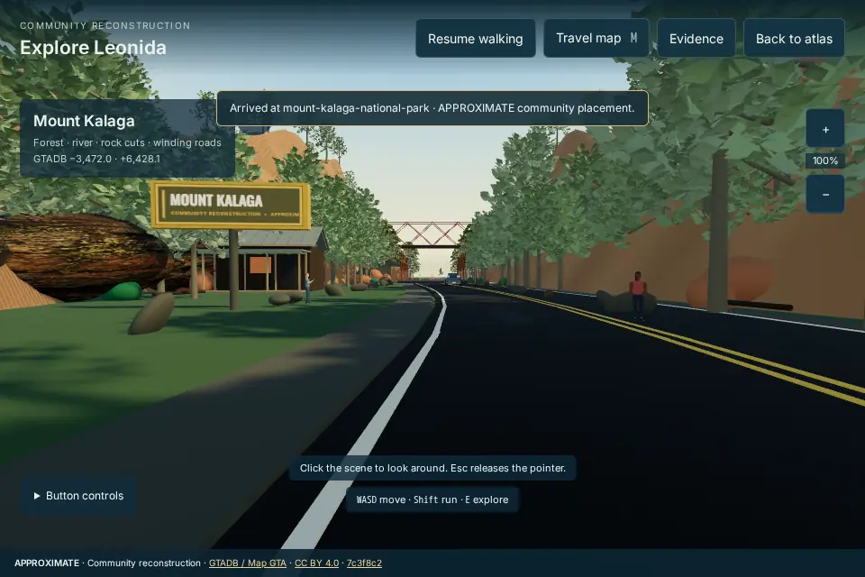

# Visual overhaul verification — v0.7.0

Validation date: **6 September 2026**. Version **0.7.0 is deployed** at [the official Leonida Atlas](https://gta6state.com/gta6-leonida-atlas/). The public pull request passed GitHub checks before integration. These captures show the same application code used by the tested official image.

Live checks confirmed that the served HTML and entry JavaScript match the tested image, the anonymous account-session endpoint responds correctly, and the deployment-only Analytics configuration is retained. The account-service and parent-site containers were unchanged; parent-site response hashes were also unchanged. Live Chromium subsequently rendered Vice City in both directions and Ambrosia without reported errors. About displayed v0.7.0 and all retained releases from v0.5.0; registration fields and consent controls were present. No account was created and no tracking consent was accepted during these checks.

## What was verified

| Check                                                         | Result                                                                                                                        |
| ------------------------------------------------------------- | ----------------------------------------------------------------------------------------------------------------------------- |
| Unit tests                                                    | **503 passed across 53 files**                                                                                                |
| TypeScript, ESLint and production build                       | Passed                                                                                                                        |
| Chromium application tests outside 3D                         | **9 passed**                                                                                                                  |
| Selected map destination → 3D, Ambrosia → Leonida Keys travel | **1 Chromium test passed**                                                                                                    |
| Six regional arrivals and Vice City facing south              | Seven production-build captures; no browser errors reported                                                                   |
| Isolated geometry and rendering                               | Hotel, arena, waterfront towers, viaduct, regional architectural details, articulated actors and clouds inspected in Chromium |

Geometry tests cover retained source footprints, landmark bounds and anchors, road and entrance clearance, roof slopes, instance budgets, animated actor transforms, tyre contact, traffic obstacles and resource cleanup. They complement the browser checks; they do not establish frame rate or visual fidelity on every device.

Independent review led to fixes for the hotel overlapping anonymous frontage, a motel porch post intruding into the road margin, the Grassrivers wave hook targeting an unused material, and repeated reflection-map generation after a fallback error. Region unloading releases new instanced geometry, materials and actor skeletons; outdoor reflection targets have explicit disposal.

## Actual renderer counters

The following values were recorded by the application during the final desktop capture run. They are renderer counters, not a count of unique assets or an FPS benchmark.

| Arrival          | Draw calls | Rendered triangles |
| ---------------- | ---------: | -----------------: |
| Vice City        |        298 |            840,163 |
| Vice City, south |        298 |            840,163 |
| Leonida Keys     |        296 |            244,103 |
| Grassrivers      |        178 |            564,928 |
| Port Gellhorn    |        301 |            224,900 |
| Ambrosia         |        329 |            329,041 |
| Mount Kalaga     |        275 |          2,065,108 |

The run used **Chromium on Linux with software SwiftShader**, at **960 × 640**. Software rendering produced slow, variable frame intervals; these results do **not** establish interactive performance or an FPS guarantee on desktop or mobile hardware. Mount Kalaga has the largest measured geometry load and particularly needs hardware profiling. Desktop source coverage in this run was 49 raster tiles; distant architectural detail remains bounded independently of that coverage.

## Touch viewport and official container

The final official Docker build was also rendered in Chromium with a **390 × 844 touch viewport**. Vice City, its south-facing view and Mount Kalaga loaded without reported errors. Their counters were respectively **104 / 71 / 121 draws** and **345,298 / 195,426 / 239,488 triangles**, with 25 source tiles retained. A real Chromium touch sequence moved the player **0.67 metres** with the joystick and changed yaw **0.27 radians** with the look pad; no page errors were reported.

This verifies the responsive controls and reduced geometry path in touch emulation. It does not measure a physical phone GPU or establish Safari/WebKit rendering performance.

## Vice City south: baseline and candidate

The baseline below was captured at **1440 × 900**; the candidate was captured at **960 × 640**. Both face south from the Vice City arrival, but viewport, aspect ratio and framing differ. This is a qualitative comparison of surrounding coverage, not a pixel-matched comparison or evidence of a performance improvement.

**Baseline**

**Candidate**

## Final regional captures

| Vice City                                                                                      | Leonida Keys                                                                                  |
| ---------------------------------------------------------------------------------------------- | --------------------------------------------------------------------------------------------- |
|  |  |

| Grassrivers                                                                                                 | Port Gellhorn                                                                                     |
| ----------------------------------------------------------------------------------------------------------- | ------------------------------------------------------------------------------------------------- |
|  |  |

| Ambrosia                                                                                                   | Mount Kalaga                                                                                                                        |
| ---------------------------------------------------------------------------------------------------------- | ----------------------------------------------------------------------------------------------------------------------------------- |
|  |  |

All eight published images are actual browser screenshots, converted to WebP with Sharp. No cropping, compositing, recoloring, generated replacement imagery or scene retouching was applied. Original dimensions are retained; the combined image payload is **325,288 bytes**, below 1 MB.

## Evidence and remaining limits

This is a community reconstruction. The original game's production assets and measured building heights, roof dimensions and terrain elevations are unavailable to this project. Regional architecture, vegetation, water appearance and canyon relief remain **APPROXIMATE** interpretations. The changes preserve reviewed map anchors and their existing evidence labels; additional decorative detail does not make an uncertain location confirmed.

Cartographic context retains attribution to **GTADB / Map GTA, yanis,16, CC BY 4.0**. Rockstar visual references inform appearance; these captures show Atlas geometry and existing project materials, not rendered game assets. Existing licensing and source information remain in [third-party licenses](../../THIRD_PARTY_LICENSES.md), [map attribution](../../public/assets/gta6-leonida-atlas/ATTRIBUTION.md) and the explorer's Evidence view.

Physical mobile GPU performance and a broad cross-browser visual sweep remain unverified. The [delivery checklist](../superpowers/plans/2026-09-06-atlas-visual-overhaul.md) records the completed work.
